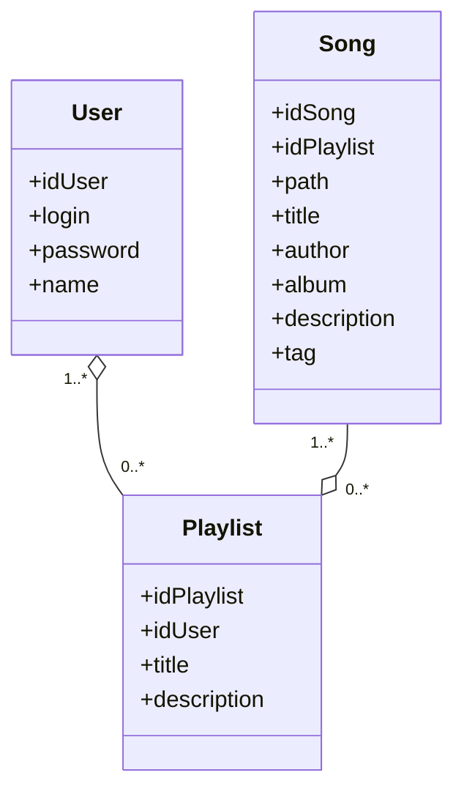

```mermaid
classDiagram

    User "1..*" o-- "0..*" Playlist
    Song "1..*" --o "0..*" Playlist

    class User{
        +idUser
        +login
        +password
        +name
    }

    class Playlist{
        +idPlaylist
        +idUser
        +title
        +description
    }

    class Song{
        +idSong
        +idPlaylist
        +path
        +title
        +author
        +album
        +description
        +tag
    }

```